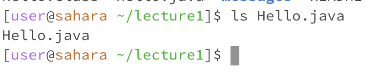
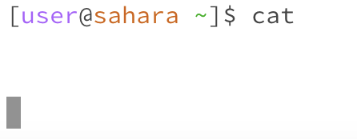
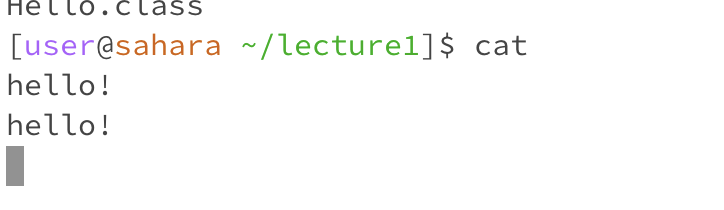
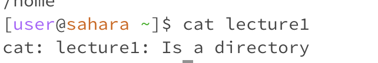
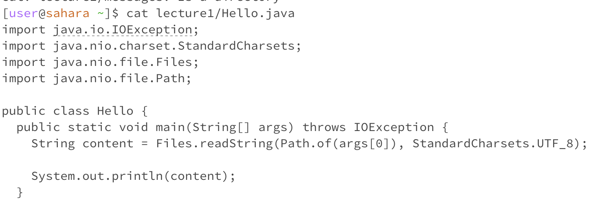

# Lab Report 1 - Remote Access and FileSystem

For each of the commands `cd`,`ls`, and `cat`, and using the workspace you created in this lab we are doing the following:

* Share an example of using the command with no arguments. 

* Share an exmaple of using the command with a path to a directory as an argument.

* Share an example of using the command with a path to a file as an argument.

## cd

#### Small overview, the `cd` command stands for "change directory", this will switch whatever respective directory we are orignally in to the one we are calling.

1) An example of using the `cd` command without any arguements would look be as followed
   

In this, we see that when we run the `cd` command in the working directory `home`, the following output does not produce anything. It is simply the action of us changing the directory. `cd` without arguments, there is no directory to change it to.

2) An example of using the command with a path a directory as as arguement would show the following
 

We see again, there is no output. However we can notice, when we use the command with a a path to the directory to the terminal, we are orignally in the home directory, therefore when we `cd lecture1` , the new line to write a new command displays `user@sahara ~/lecture1]$` meaning that we are now working out of the directory of lecture1 

3) Finally, lets naviagate to a file.
   

It looks like there is an error. Why is that? This is because `cd` means change directory. When we pass an arguement with a file, a file is not a directory. Lecture1 is our current working directory. Therefore if we run the command `cd` and try to access a file that is not in the current directory or the file itself, an error will occur becasue there is no directory that matches that name. Even if the file was in our current working directory, there would still be an error because a file is not a directory, therefore `cd` is not applicable to `Hello.class`

## ls
#### A small overvirew of `ls`, shorthand for "list, as in listing the files and folders of the given path our console is currently working with

1) An example of using `ls` as itself and no entitity to folllow is:
  

Here, we see the output is lecture1, this is becasue we are curerntly in the home directory. if we change our path to lecture1, and then run the empty `ls` command, we would see the contents within leture 1. This is actually what the program is supposed to do. There is no error present.

2) Next, lets access a directory with this command: 

Since we have accessed the directory, we can show the name of the files and folders within that directory. Our curernt directory is `home`, however, `home` gives us access to to any of the directories within the current one. In this case when we `ls lecture1`, it prints the names of each respective file and program. This is not  an error!

3) Finally, we will use the `ls` command to a file:

using the `ls lecture1/messages` command, we can see the name of the files within this folder, in this case being the name of the text files of the respective languages translating to "Hello World!". If we were to run another ls command to a file such as `Hello.class`, there is only "one file" within the "file" so we would get the output `Hello.class` as it is a single entitiy. This is not an error as we are displaying the name of a certain file

## cd 
#### Lets now utilize the cat command. cat is shorthand for "concatenate"- which is uswed to print the contents that are in the files of the respective path.

1) As we have continually done, lets run cat without any arguemnt:

Confusing right? What do we do now? We see this visual because when we run a `cat` command the console is waiting for us to input something until we personally terminate the program. But as we are waiting, what happens if we input something into the console?

There seems to be a duplication of any output that keeps on running until we eventually terminate the program. This is could be considered an error as there is nothing to come of it and running an empty `cat` command is insuffienct. It is important to mention in both cases, we are working from the `home` directory. So even with access to an abundance of folders with contents, `cat` empty still will not give us anything more.

2) Next, lets run cat with a path to a directory

In this command, we are actually working out of the `home` directory. Therefore `cat lecture1` is a file in the direfctroy and is accessible to make arguemnts and commands for. We see the output `cat: lecture: Is a directory` This is because the purpose of `cat` is to print the contents of the files. When we call `cat` to something other than a file, there ovbiously is nothing to print therefore we incur this error message. 

3) Finally, lets run what the command is actually needed for, printing the contents of a file:

This is all the contents of the Hello.Java file! In order to get this output, we have to access the `lecture1` directory once again, which gives access to this file directly if needed. We could `cat lecture1/Hello.java` to directly access the lecture1 directory and print the contents of the Hello.java program. This is not an error!
