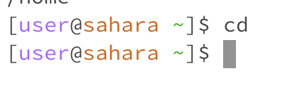
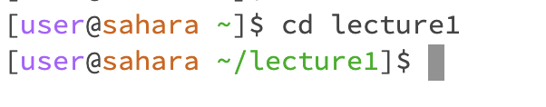
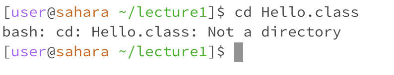
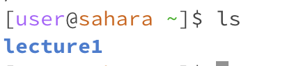

# Lab Report 1 - Remote Access and FileSystem

For each of the commands `cd`,`ls`, and `cat`, and using the workspace you created in this lab we are doing the following:

* Share an example of using the command with no arguments.

* Share an exmaple of using the command with a path to a directory as an argument.

* Share an example of using the command with a path to a file as an argument.

## cd

#### Small overview, the `cd` command stands for "change directory", this will switch whatever respective directory we are orignally in to the one we are calling.

1) An example of using the `cd` command without any arguements would look be as followed
   

In this, we see that when we run the `cd` command in the working directory `home`, the following output does not produce anything. It is simply the action of us changing the directory. `cd` without arguemnts will just return us to the home directory

2) An example of using the command with a path a directory as as arguement would show the following
   

We see again, there is no output. However we can notice, when we use the command with a a path to the directory to the terminal, in this case lecture 1, the new line to write a new command displays `user@sahara ~/lecture1]$` meaning that we are now working out of the directory of lecture1 

3) Finally, lets naviagate to a file.
   

It looks like there is an error. Why is that? This is because `cd` means change directory. When we pass an arguement with a file, a file is not a directory. Therefore if we run the command `cd` and try to access a file that is not in the current directory or the file itself, an error will occur becasue there is no directory that matches that name.

## ls
#### A small overvirew of `ls`, shorthand for "list, as in listing the files and folders of the given path our console is currently working with

1) An example of using `ls` as itself and no entitity to folllow is:
  

