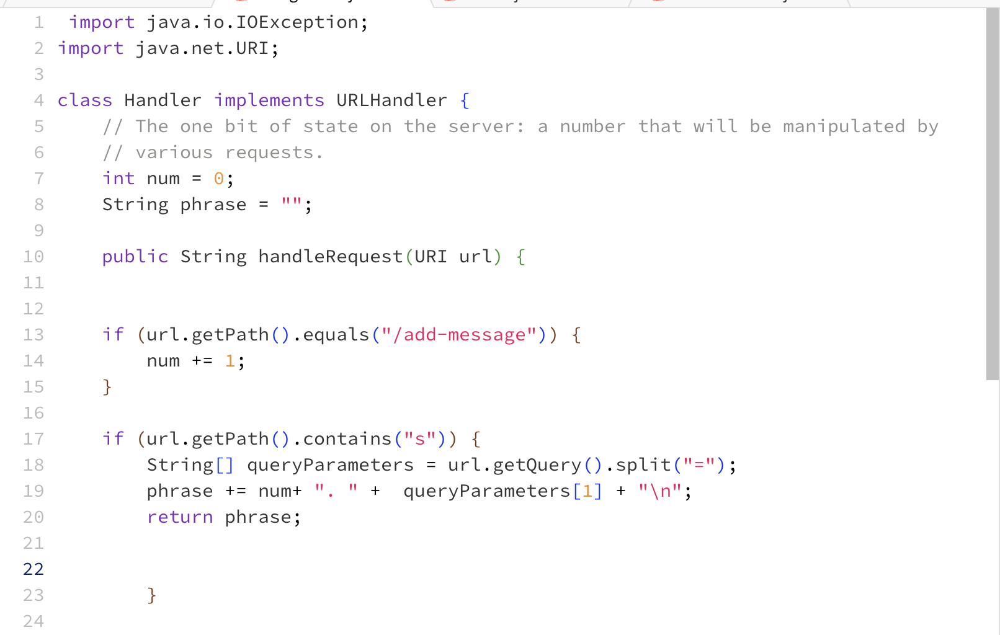
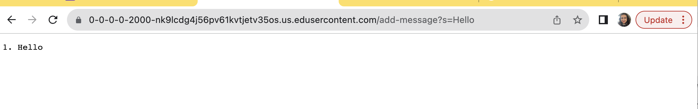
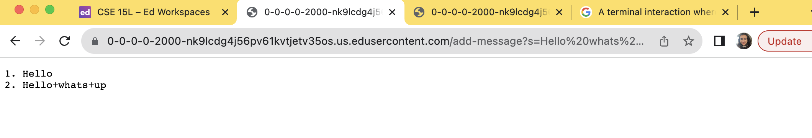
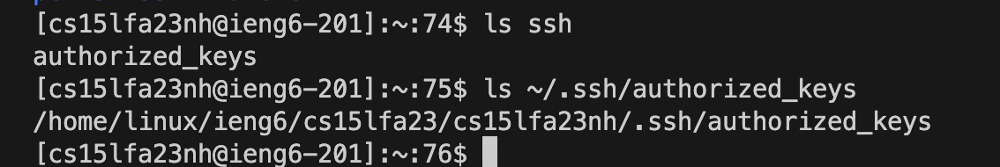
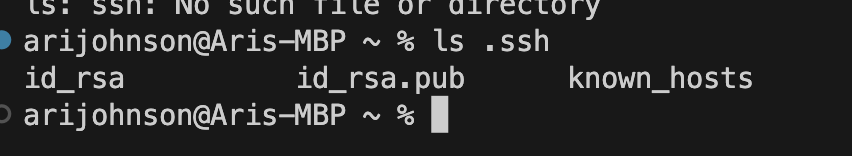
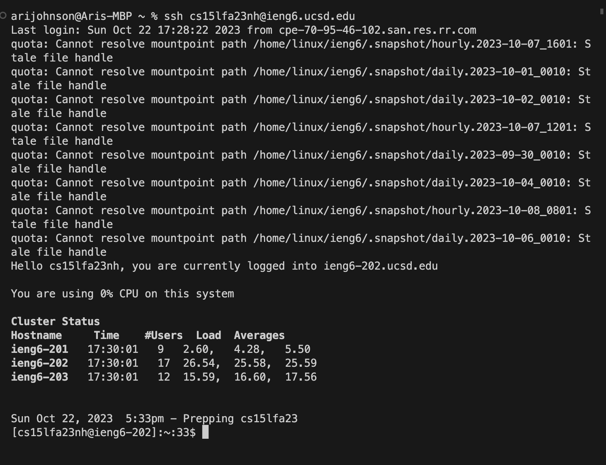

# Lab 2 #

First, lets show the code we are working with in order to make sure the outputs within the respective arguemnts are valid with the given paths:

The methods called in this screenshot is the `add-message`, the query, and the phrase that we are writing after the `s=` block. Our fields **num** and **phrase** are initialized to 0, and "". This is our baseline, and as we pass arguments, they will update and take those values. The relevant arguements that we will be passing through the methods are those that we want displayed on the computer screen. In this case, the assignment calls for certain string values to appear sequentially. The program will take in anything past the `s=` block and print that on the screen, increment the number, and move on. In this first case, we utilized the path of `/add-message?s=Hello` and our output was what we expected:

Next we will change it up a bit, We are still utilizng the same methods, and the plan is for anything after the `s=`to be printed on the screen, however now, we hae some changes. Our number we saw before the first "Hello!", will now be changed and incremented by a factor of 1, and this trend actually continues the more we input certain string arguemnts to update the field values. We will now add a new message, but this is more of a statement. It does the same thing it is supposed to, however the field that changes now is the incremented number and the phrase is now updated and displayed under our first argument. This trend will continue the more arguments we pass in the URL: 

## USING LS IN PUBLIC AND PRIVATE SERVERS ##

The following is the path to the **PRIVATE** key for your SSH key for logging into ieng6: 

The following is the path to the **PUBLIC** key for your SSH key for logging into ieng6: 

Here is the terminal interaction in which I did not need to provide a key to log into my ieng6 account!: 

## What I have learned ##
Wowza. I can safely say without any doubt I have learend a lot. Anything as small as making a github account, to learning how to manipulate URL paths to produce certain outputs to the screen. I am a little behind in the sense of retention of knowledge. However I am also working on trying to stay up with the assingments. From learning how to see what my current directory is, to knowing what a query is, I can say that my knowledge of this aspect of programming has vastly increased. Something memorable I will say that I learned in the previous labs, is that I can always reset my directory and "start fresh" by simply typing `cd` into the command line. Also markdown has been a blast to figure out.
