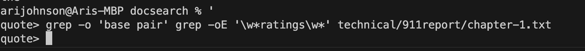
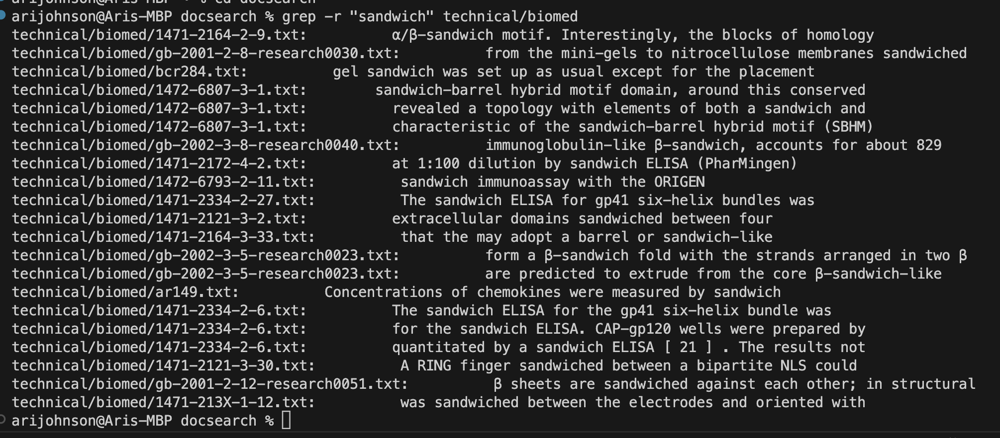
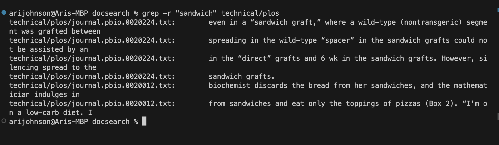
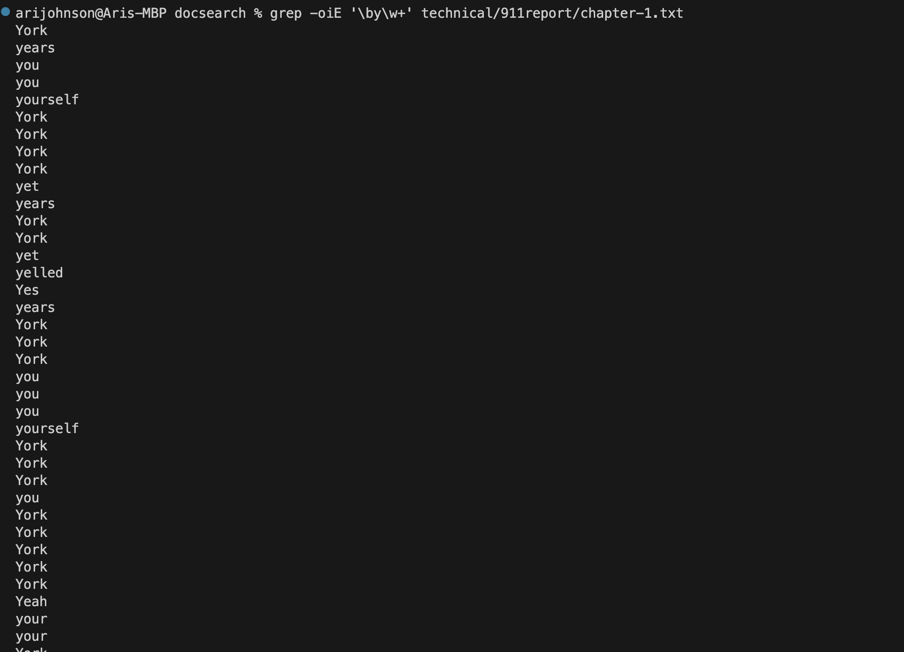
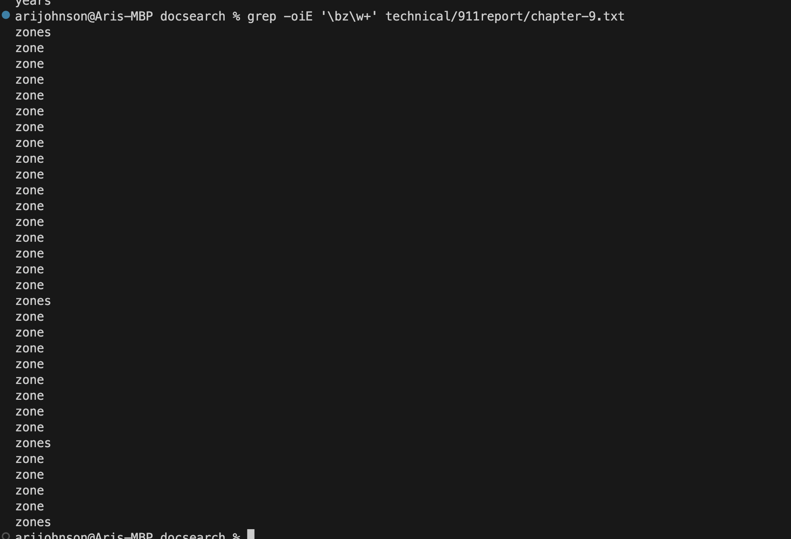

# LAB REPORT 3 #

## Symptoms and Failure- Inducing Inputs using Array Methods ##

The bug I am choosin for this lab report is the `reversedInPlace` bug.

### The failure inducing input , *testreversed*

```

  @Test
  public void testReversed() {
    int[] input1 = {1,2,3 };
    assertArrayEquals(new int[]{3,2,1}, ArrayExamples.reversed(input1));
  }
}
```
### TEST CODE 
 ```
 static int[] reversed(int[] arr) {
    int[] newArray = new int[arr.length];
    for(int i = 0; i < arr.length; i += 1) {
      arr[i] = newArray[arr.length - i - 1];
    }
    return arr;
  }
```


### The success inducing input *reversedInPlace*

```
public class ArrayTests {
	@Test 
	public void testReverseInPlace() {
    int[] input1 = {3,4,5,6,7 };
    ArrayExamples.reverseInPlace(input1);
    assertArrayEquals(new int[]{7,6,5,4,3 }, input1);
	}
```
### TEST CODE

```
public class ArrayExamples {

  // Changes the input array to be in reversed order
  static void reverseInPlace(int[] arr) {
    for(int i = 0; i < arr.length/2; i += 1) {
     int temp = arr[arr.length - i - 1];
     arr[arr.length - i - 1] = arr[i];
     arr[i] = temp;
    }
  }
```
## Running tests symptom!


The symptom is the array was not reversed as it was suppossed too. The symptom of the bug would be a constant output of zero

## Bug Before and After

### Before
 ```
 static int[] reversed(int[] arr) {
    int[] newArray = new int[arr.length];
    for(int i = 0; i < arr.length; i += 1) {
      arr[i] = newArray[arr.length - i - 1];
    }
    return arr;
  }
```
### After

```
 static int[] reversed(int[] arr) {
    int[] newArray = new int[arr.length];
    for(int i = 0; i < arr.length; i += 1) {
      newArray[arr.length - i - 1] = arr[i];
    }
    return newArray;
  }
```
The code that changes is that the newArray takes the value of the 0 element making the reveresed method tracking backwards instead of forwards.

## PART 2 - COMMAND RESEARCH : GREP

### 1) `grep -oE '\w*STRING\w*' "..".txt`

`grep -o 'base pair' grep -oE "w×ratings\w' technical/911report/chapter-1.t×t`
#### TEST AND OUTPUT: 


`grep -oiE '\by\w+' technical/911report/chapter-1. txt`
#### TEST AND OUTPUT:


**`grep -oE '\w*STRING\w*' "..".txt`**

The `-E` option and then following a text-string, grep will act on any expression syntax in that particular text-string.To find all words that are either the word or a the word as part of a bigger word, use `-E` to specify the pattern, combined with `-o` to show just the matched word, and not the entire line it is on. The `"w"` in between each string has to do with that respective word itself.

### 2) `grep -r "string" "/.."`

`grep -r "sandwich" technical/biomed`
#### TEST AND OUTPUT: 


`grep -r "sandwich" technical/plos`
#### TEST AND OUTPUT:


**grep -r "string" "/.."`**

`-r` is when you want to search in all the files under the current directory and its sub directory. `-r` looks for the string in the current directory and all it’s subdirectory and displays the file it is in as well as the entire line it is on.

### 3) `grep -oiE '\__\w+' "__".txt`

`grep -oiE '\by\w+' technical/911report/chapter-1.txt`
#### TEST AND OUTPUT: 


`grep -oiE '\bz\w+' technical/911report/chapter-9.txt`
#### TEST AND OUTPUT:



