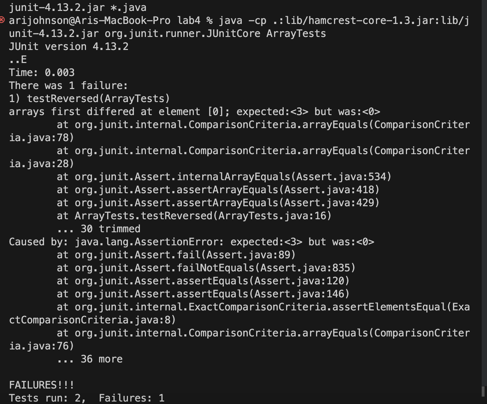

# LAB REPORT 3 #

## Symptoms and Failure- Inducing Inputs using Array Methods ##

The bug I am choosin for this lab report is the `reversedInPlace` bug.

### The failure inducing input , *testreversed*

```

  @Test
  public void testReversed() {
    int[] input1 = {1,2,3 };
    assertArrayEquals(new int[]{3,2,1}, ArrayExamples.reversed(input1));
  }
}
```
### TEST CODE 
 ```
 static int[] reversed(int[] arr) {
    int[] newArray = new int[arr.length];
    for(int i = 0; i < arr.length; i += 1) {
      arr[i] = newArray[arr.length - i - 1];
    }
    return arr;
  }
```


### The success inducing input *reversedInPlace*

```
public class ArrayTests {
	@Test 
	public void testReverseInPlace() {
    int[] input1 = {3,4,5,6,7 };
    ArrayExamples.reverseInPlace(input1);
    assertArrayEquals(new int[]{7,6,5,4,3 }, input1);
	}
```
### TEST CODE

```
public class ArrayExamples {

  // Changes the input array to be in reversed order
  static void reverseInPlace(int[] arr) {
    for(int i = 0; i < arr.length/2; i += 1) {
     int temp = arr[arr.length - i - 1];
     arr[arr.length - i - 1] = arr[i];
     arr[i] = temp;
    }
  }
```
## Running tests symptom!


The symptom is the array was not reversed as it was suppossed too. The symptom of the bug would be a constant output of zero

## Bug Before and After

### Before
 ```
 static int[] reversed(int[] arr) {
    int[] newArray = new int[arr.length];
    for(int i = 0; i < arr.length; i += 1) {
      arr[i] = newArray[arr.length - i - 1];
    }
    return arr;
  }
```
### After

```
 static int[] reversed(int[] arr) {
    int[] newArray = new int[arr.length];
    for(int i = 0; i < arr.length; i += 1) {
      newArray[arr.length - i - 1] = arr[i];
    }
    return newArray;
  }
```
The code that changes is that the newArray takes the value of the 0 element making the reveresed method tracking backwards instead of forwards.
