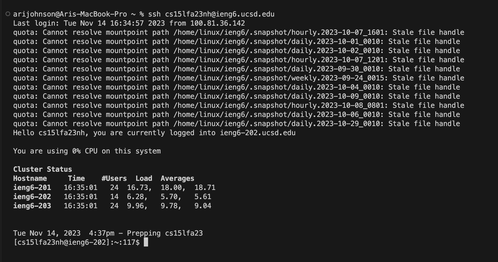
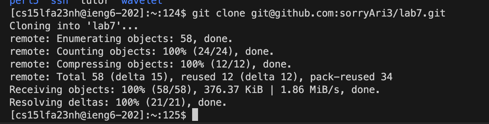
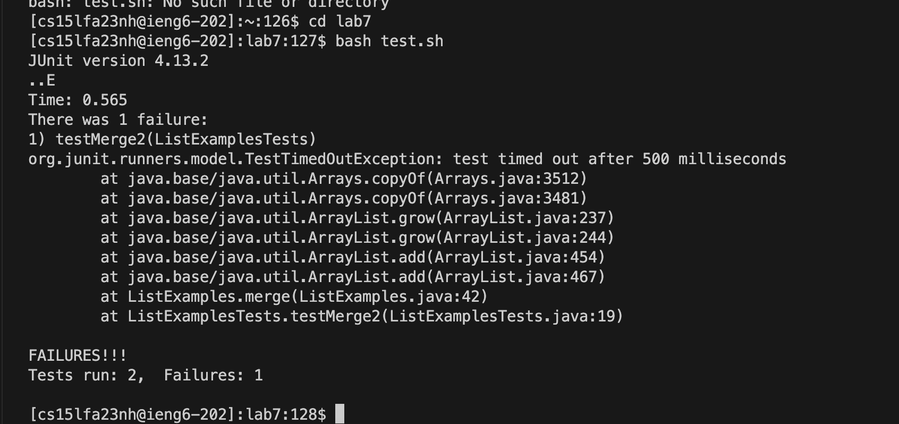
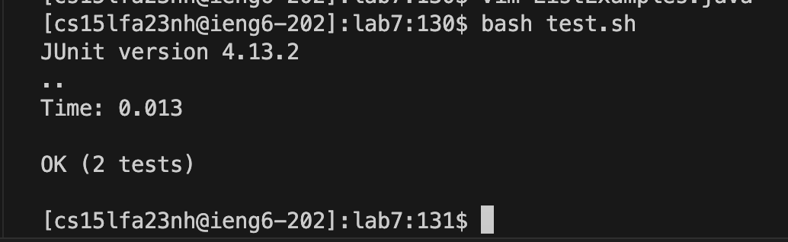

# LAB REPORT 4 

## We are to repeat steps 4-9 and demostrate what we did down below::

### Step 4: Log into ieng6
I clicked on `Ctrl-R` to check the history of my recent searches and typed in `ss` followed by `<Enter>` to autofill to `ssh cs15lfa23nh@ieng.ucsd.edu` 

### Step 5: Clone your fork of the repository from your Github account (using the SSH URL)
After copying the ssh URL from the forked repository on github, I typed in `git clone` followed by `command-V` to paste the ssh URL which was `git@github.com:sorryAri3/lab7.git` followed by `<Enter>`

### Step 6: Run the tests, demonstrating that they fail
Typed in `bash tests.sh` followed by `<Enter>` to obtain the following:

### Step 7: Edit the code file to fix the failing test
Opened up the text editor by typing `vim ListExamples.java` followed by `<Enter>`

**Inside Vim**
- Typed `/index1` followed by `<Enter>`
- `n,n,n,n,n,n,n,n,n` --> utilized the **n** key nine times to get to the piece of the code we wanted to edit:
- pressed `<space>,<space>,<space>,<space>,<space>,<space>,<space>,<space>,<space>` --> space 9 times to get cursor right above the *1* in *index1*

.png)

- Typed `r,2` in order to replace the *1* in *index1* with **2** to make **index2**
.png)

- Typed `:` `w` `q` `!` to save and quit out of the vim program
  
### Step 8: Run the tests, demonstrating that they now succeed
Took a quicker way and typed `Ctrl-R` followed by `b` `a` `s` then `<Enter>` to reobtain the command `bash tests.sh`. After pressing `<Enter>` once more, I obtained:

### Step 9: Commit and push the resulting change to your Github account
- typed `git add ListExamples.java` and `<Enter>` followed by `git Commit` and `<Enter>`. Once prompted to create a command message, pressed <Enter> once more, followed by `I` to insert messsage and typed `I finished the lab!` - then clicked `<Esc>` followed by `:` `w` `q` `!` in order to save the commit message.
 .png)

- Typed in `git push` followed by `<Enter>` to obtain:
.png)

#### All done! Here is a photo of the changed code in my repository on GitHub:  
.png)
