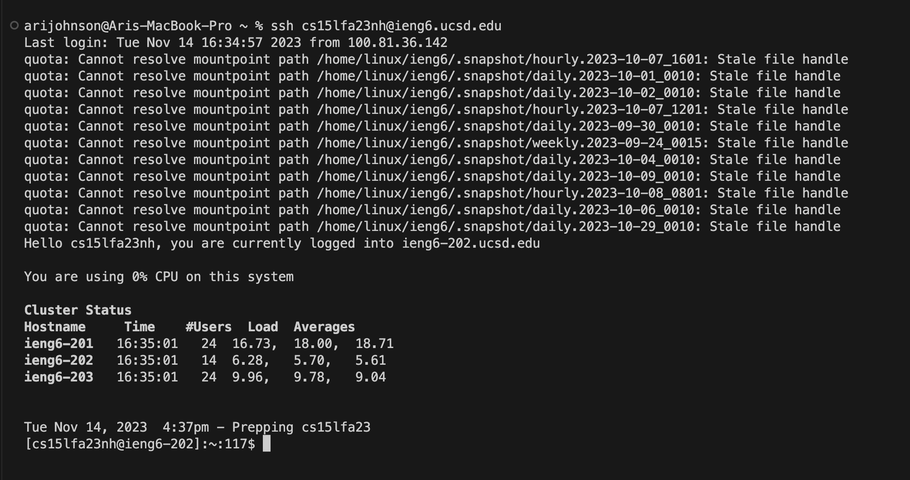
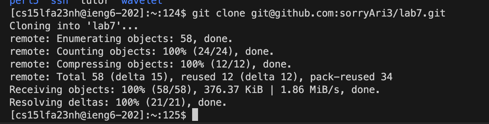
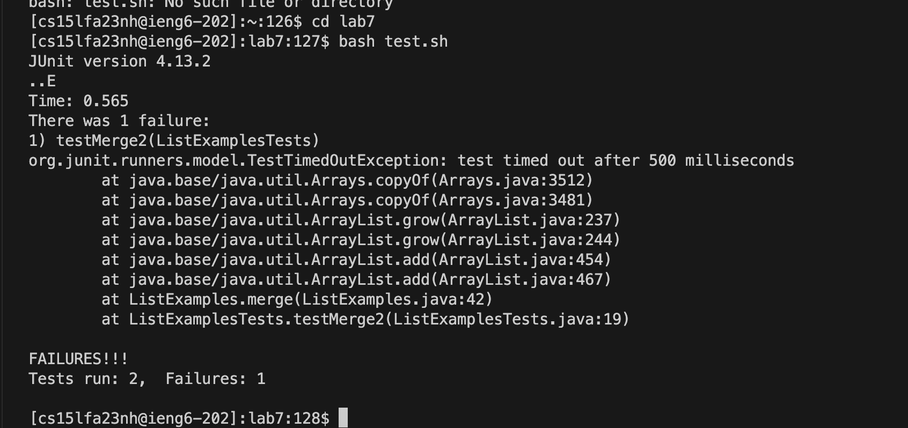

# LAB REPORT 4 

## We are to repeat steps 4-9 and demostrate what we did down below::

### Step 4: Log into ieng6
I clicked on `Ctrl-R` to check the history of my recent searches and typed in `ss` followed by `<Enter>` to autofill to `ssh cs15lfa23nh@ieng.ucsd.edu` 

### Step 5: Clone your fork of the repository from your Github account (using the SSH URL)
After copying the ssh URL from the forked repository on github, I typed in `git clone` followed by `command-V` to paste the ssh URL which was `git@github.com:sorryAri3/lab7.git` followed by `<Enter>`

### Step 6: Run the tests, demonstrating that they fail
Typed in `bash grades.sh` followed by `<Enter>` to obtain the following:

### Step 7: Edit the code file to fix the failing test

### Step 8: Run the tests, demonstrating that they now succeed

### Step 9: Commit and push the resulting change to your Github account
