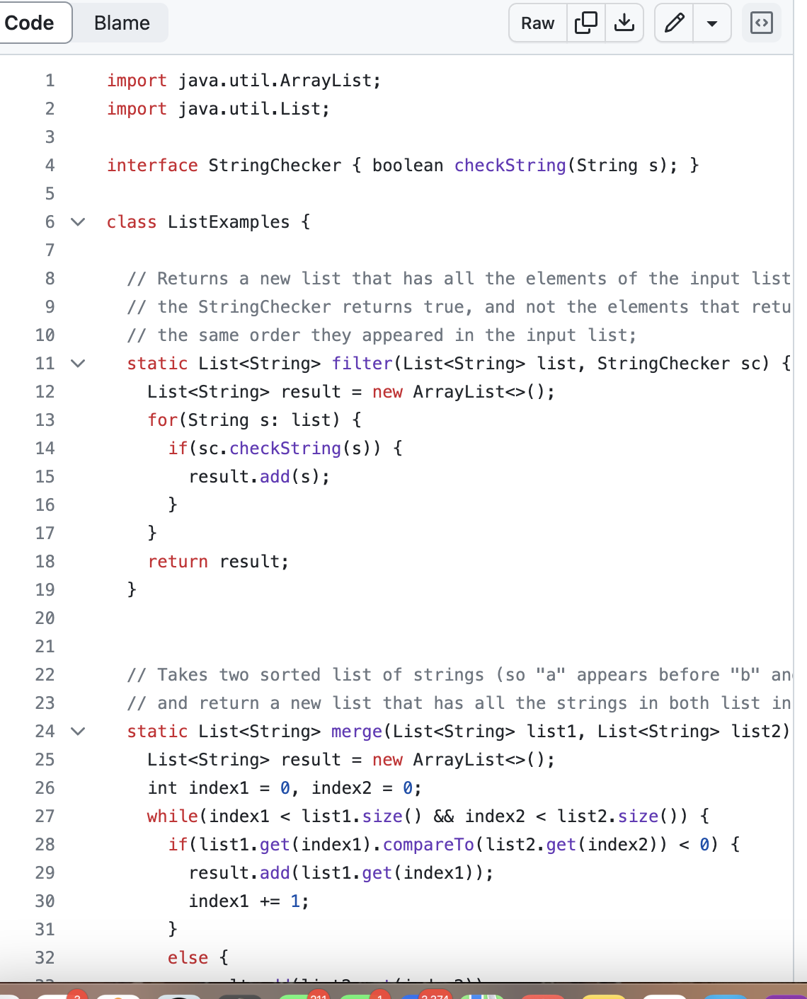
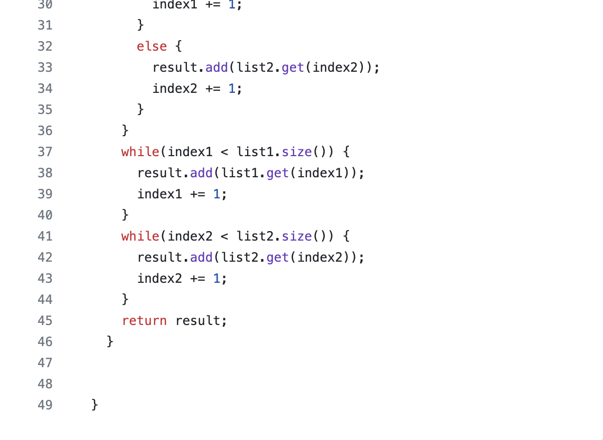

# Lab Report 5

## Part 1 - Debugging Scenario

### 1) Initial Post

#### The Code the student attached:

### 2) TA Response:
Upon evaluating the tests and looking over the code, I as the TA noticed there were some syntax errors and swapped variables - once I ran the test myself, I noticed the code compiled but there was a failed tests - now what could that have been? This is what I would challenge the student to look at once they fixed the minor bugs:

### 3) Success?!

#### The successful List.Examples.java code with the edited `Filter` method:

## Part 2 - Reflection 

