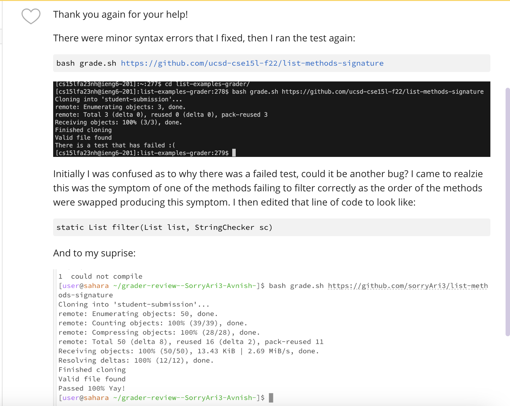

# Lab Report 5

## Part 1 - Debugging Scenario
### 1) Initial Post


#### The Code the student attached:
**List-Examples.java:**
```
import java.util.ArrayList;
import java.util.List;

interface StringChecker { boolean checkString(String s); }

class ListExamples {
  // Returns a new list that has all the elements of the input list for which
  // the StringChecker returns true, and not the elements that return false, in
  // the same order they appeared in the input list;
  static List<String> filter(StringChecker sc, List<String> list) {
    List<String> result = new ArrayList<>();
    for(String s: list) {
      if(sc.checkString(s)) {
        result.add(s);
      }
    }
    return result;
  }
  // Takes two sorted list of strings (so "a" appears before "b" and so on),
  // and return a new list that has all the strings in both list in sorted order.
  static List<String> merge(List<String> list1, List<String> list2) {
    List<String> result = new ArrayList<>();
    int index1 = 0, index2 = 0;
    while(index1 < list1.size() && index2 < list2.size()) {
      if(list1.get(index1).compareTo(list2.get(index2)) < 0) {
        result.add(list1.get(index1));
        index1 += 1;
      }
      else {
        result.add(list2.get(index2));
        index2 += 1;
      }
    }
    while(index1 < list1.size()) {
      result.add(list1.get(index1));
      index1 += 1;
    }
    while(index2 < list2.size()) {
      result.add(list2.get(index2));
      index2 += 1;
    }
    return result;
  }
```
**bash grade.sh script to run the tests:**
```
CPATH='.:lib/hamcrest-core-1.3.jar:lib/junit-4.13.2.jar'

rm -rf student-submission
rm -rf grading-area

mkdir grading-area


git clone $1 student-submission
echo 'Finished cloning'

if ! [[ -e $submission ]]
then
    echo "Error, nothing found"
    exit
elif  ! [[ -f $submission/ListExamples.java ]]
then 
    echo "Error, no file found"
    exit
else
    echo "Valid file found"
fi
cp -r $submission/* grading-area
cp -r *.java grading-area
cp -r lib grading-area
cd grading-area

javac -cp $CPATH *.java

testCode=$?
if [[ $testCode -ne 0 ]]
then 
    echo $testCode " could not compile"
    exit
fi 

java -cp $CPATH org.junit.runner.JUnitCore TestListExamples > output.txt
failureString=`grep "FAILURES!!!" output.txt`

if [[ $failureString == "" ]]
then
    echo "Passed 100% Yay!"
else
    echo "There is a test that has failed :("
fi
```
### 2) TA Response:
Upon evaluating the tests and looking over the code, I as the TA noticed there were some syntax errors and swapped variables - once I ran the test myself, I noticed the code compiled but there was a failed tests - now what could that have been? This is what I would challenge the student to look at once they fixed the minor bugs:

#### 3) Success?!


#### The successful List.Examples.java code with the edited `Filter` method:

```
import java.util.ArrayList;
import java.util.List;

interface StringChecker { boolean checkString(String s); }

class ListExamples {

  // Returns a new list that has all the elements of the input list for which
  // the StringChecker returns true, and not the elements that return false, in
  // the same order they appeared in the input list;
  static List<String> filter(List<String> list, StringChecker sc) {
    List<String> result = new ArrayList<>();
    for(String s: list) {
      if(sc.checkString(s)) {
        result.add(s);
      }
    }
    return result;
  }
  // Takes two sorted list of strings (so "a" appears before "b" and so on),
  // and return a new list that has all the strings in both list in sorted order.
  static List<String> merge(List<String> list1, List<String> list2) {
    List<String> result = new ArrayList<>();
    int index1 = 0, index2 = 0;
    while(index1 < list1.size() && index2 < list2.size()) {
      if(list1.get(index1).compareTo(list2.get(index2)) < 0) {
        result.add(list1.get(index1));
        index1 += 1;
      }
      else {
        result.add(list2.get(index2));
        index2 += 1;
      }
    }
    while(index1 < list1.size()) {
      result.add(list1.get(index1));
      index1 += 1;
    }
    while(index2 < list2.size()) {
      result.add(list2.get(index2));
      index2 += 1;
    }
    return result;
  }

}
```
## Part 2 - Reflection 
As someone who only really knows basic Java, C++, and some Phython, this all is so new and interesting to me. Something I really did enjoy learning about was the "private and public" key. I could log in to my ssh server from my own computer without all the tedious passwords. VIM was something that was also an interesting learn, editing from the command line, though tedious was a quick and effective way to edit code. Finally `git add` `git commit` and `git push` - I found it so cool I was able to not have to "copy and paste" from my own computer code and could just update my github without issue with those commands. I hope to be learning more about CS in future courses as I have come to really enjoy the concepts.

